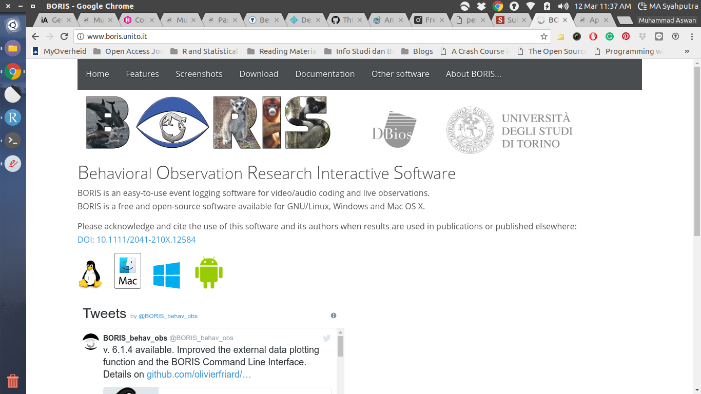
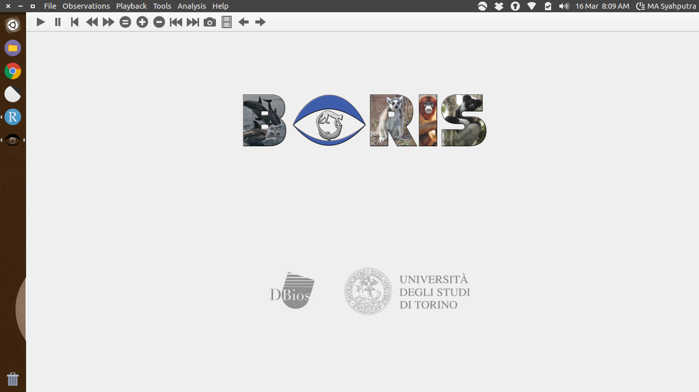
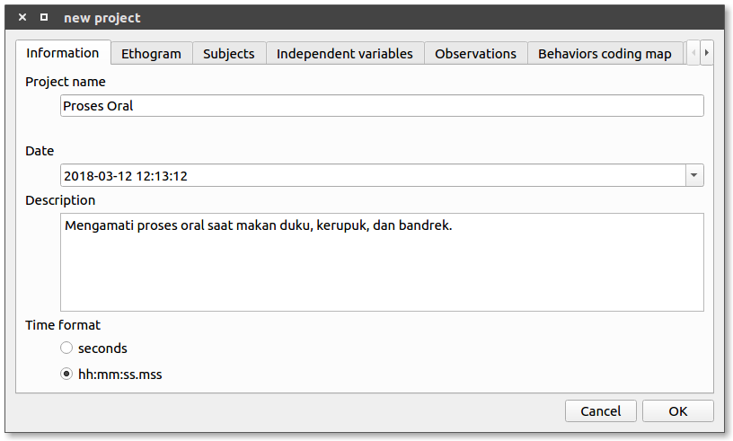
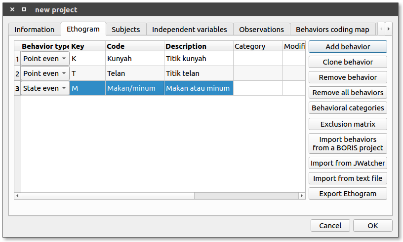
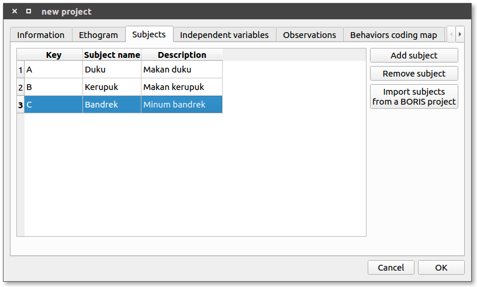
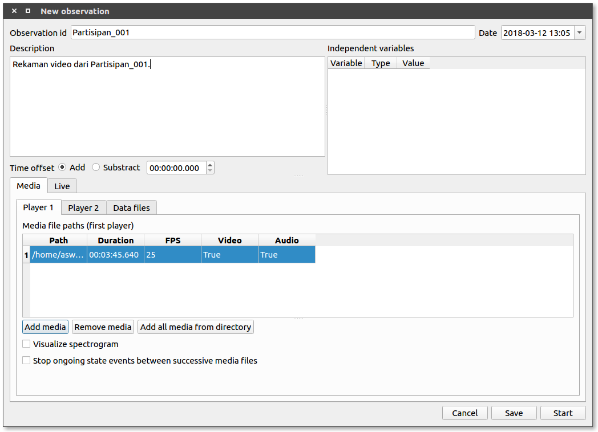
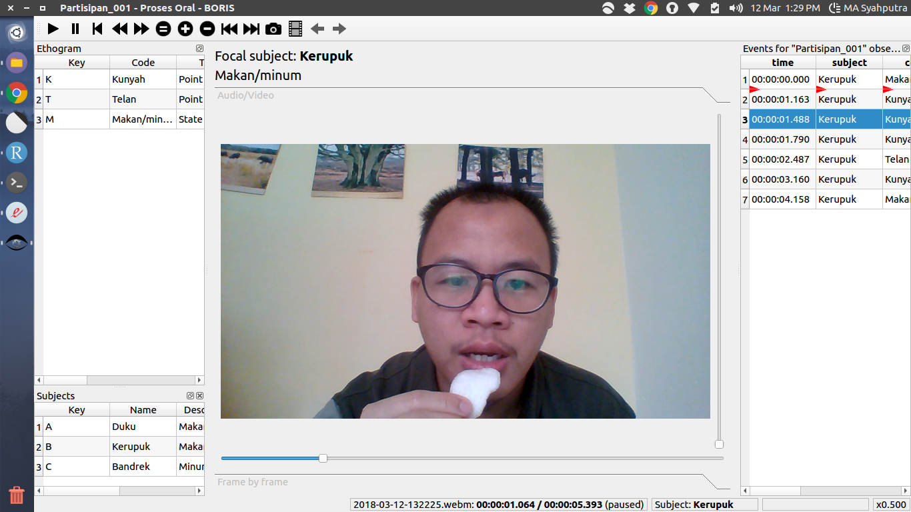
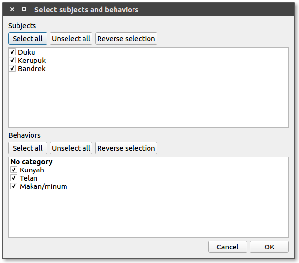
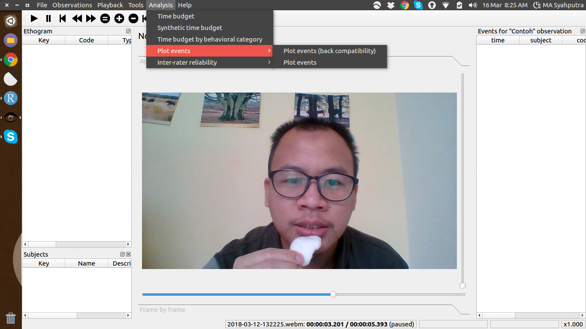

# Analisis Proses Oral Menggunakan Rekaman Video
Muhammad Aswan Syahputra

---

## Pengantar

- **Sarjana:** Ilmu dan Teknologi Pangan, Teknologi Hasil Pertanian, Universitas Brawijaya
- **Skripsi:** Studi  Eksploratori Efek Cara Konsumsi Es Kopi Instan Terhadap Persepsi Multisensoris Konsumen Menggunakan Metode *Rate-all-that-apply* (RATA)
- **Magister:** *Sensory Science, Food Technology, Wageningen University and Research*
- **Tesis:** *Capturing the oral processing of food with photoplethysmography (PPG); an alternative for electromyography (EMG)?*
- **Minat:** Ilmu sensoris, bahasa pemrograman R, statistik, perangkat lunak bebas dan sumber terbuka

 
**_Penerima Beasiswa Pendidikan Indonesia dari Lembaga Pengelola Dana Pendidikan (LPDP)_**
 
[https://aswansyahputra.com](https://aswansyahputra.com)

---

## Proses oral
Proses oral (*oral processing*) merupakan salahsatu komponen penting yang diamati dalam bidang ilmu sensoris. Proses oral dapat diartikan sebagai rangkaian utuh sejak makanan dimasukan dalam mulut hingga akhirnya ditelan.

Proses oral terdiri atas beberapa paramater, diantaranya adalah gigitan pertama, ukuran gigitan, kekuatan gigitan, banyaknya kunyahan, frekuensi kunyahan, durasi, serta titik telan.

Metode untuk mengamati proses oral saat makan misalnya melalui pengamatan video, *Electromyography* (EMG), *videofluorography*, sensor tekanan, *Magnetic Resonance Imaging* (MRI), dan lain-lain . Masing-masing metode memiliki fungsi, tujuan pemakaian, seta kelebihan dan kelemahan tersendiri.

---

## Video
<iframe width="560" height="315" src="https://www.youtube.com/embed/qcRtt1KGOf8?rel=0&amp;showinfo=0" frameborder="0" allow="autoplay; encrypted-media" allowfullscreen></iframe>

---

## Pengamatan video
Metode ini sendiri dapat dikelompokan menjadi dua, yaitu:

> - Berdasarkan pengamatan oleh pangamat (*observer*). Contoh perangkat lunak: [Observer XT](http://www.noldus.com/human-behavior-research/products/the-observer-xt), [BORIS](http://www.boris.unito.it/)
> - Berdasarkan analisis pergerakan titik (*dot movement tracking*). Contoh perangkat lunak: [Kinovea](https://www.kinovea.org/), [Physmo](http://physmo.sourceforge.net/), [Tracker](https://physlets.org/tracker/)

[Observer XT](http://www.noldus.com/human-behavior-research/products/the-observer-xt) dan [BORIS](http://www.boris.unito.it/) memiliki fitur yang kurang lebih sama untuk digunakan dalam mengamati proses oral saat makan. Luaran yang akan didapatkan adalah parameter banyaknya kunyahan, titik telan, dan durasi makan.

---

## Mengunduh perangkat lunak BORIS
BORIS  (*Behavioral Observation Research Interactive Software*) merupakan perangkat lunak *multiplatform* sehingga dapat digunakan di sistem operasi Linux, Windows, maupun Mac. Anda dapat mengunduh perangkat lunak BORIS secara gratis melalui tautan [ini](http://www.boris.unito.it/pages/download.html).

---

## Menggunakan perangkat lunak BORIS

- **Skenario:** mengamati proses oral subyek yang sedang mengkonsumsi makanan secara *ad libitum* (bebas jumlah dan durasi). Subyek direkam dari arah depan dan penyajian sampel dilakukan secara acak antar subyek.
- **Parameter:** jumlah kunyahan, titik telan, dan durasi makan.

---

## Membuat proyek
Klik '*File - New project*'. Silakan isi nama proyek pada *Project name*, tanggal pada *Date*, deskripsi proyek (disarankan untuk diisi) pada *Description*, dan pilih *Time format* sesuai kebutuhan.

---

## Membuat atau mengubah *Ethogram*
*Ethogram* merupakan daftar perilaku atau parameter yang akan diamati melalui video.
Pada jendela *new project*, pilih menu *Ethogram* kemudian tambahkan parameter dengan cara klik '*Add behaviour*'. Beri kunci tombol dan kode pada masing-masing perilaku yang akan digunakan saat mengamati video. Masing-masing diatur pada bagian '*Key*' dan '*Code*'.

---

## Menentukan obyek pengamatan
Pengaturan ini dilakukan masih dalam jendela '*new project*' pada menu '*Subject*'. Silakan menambahkan obyek dengan cara klik '*Add subject*' kemudian atur tombol kunci, nama, serta deskripsi masing-masing pada menu '*Key*', '*Subject name*', dan '*Description*'. Setelah semua diatur maka silakan klik '*OK*'. Anda dapat melakukan perubahan dengan cara klik '*File - Edit Project*'.

---

## Memulai pengamatan
Pengamatan dilakukan satu per satu setiap partisipan. Klik '*Observations - New Observation*'. Masukan '*Observation id*', deskripsi, dan tambahkan dokumen rekaman video dengan cara klik '*Add media*'. 

---

## Melakukan pengamatan
Dalam contoh ini Partisipan_001 sedang mengkonsumsi kerupuk sehingga kita harus mengatur fokus (*Focal subject*) dengan cara menekan tombol kunci kerupuk yaitu tombol huruf B. Saat obyek telah berganti, misalnya obyek berikutnya adalah buah duku, maka pengamat dapat mengganti fokus dengan cara menekan tombol kunci untuk buah duku (tombol huruf 'A'). 

---

## Mengekspor hasil pengamatan
Hasil pengamatan untuk seluruh partisipan dapat dilakukan dengan cara klik '*Observations - Export aggregated events*' kemudian pilih '*Select all*' dan klik '*OK*'. Selanjutnya centang semua *Subject* dan *Behaviour* dan klik '*OK*'. 

---

## Analisis dan Grafik
BORIS memiliki fitur untuk melakukan analisis serta membuat grafik. FItur ini dapat diakses melalui menu '*Analysis*.

---

# Praktek menggunakan BORIS dan contoh analisis

---

## Contoh penelitian menggunakan pengamatan rekaman video
Mengamati variasi interindividual:

- *Chewer* vs *smoosher*
- Laki-laki vs perempuan
- Perbedaan kelompok usia
- Kultur

Mengamati pengaruh karakteristik makanan terhadap perilaku:

- Tekstur terhadap durasi makan
- Jenis makanan terhadap frekuensi kunyah

---

## Kelebihan dan kelemahan
**Kelebihan**

- *Golden standard* jika dilakukan oleh dua pengamat independen
- Informasi detail terhadap paramater proses oral: jumlah kunyahan, frekuensi kunyahan, durasi makan.
- Cocok digunakan untuk mengamati proses makan secara utuh.
- Tidak *invasive* (melukai) terhadap partisipan.

**Kekurangan**

- Pengolahan data memerlukan waktu yang lama
- Tidak ada informasi mengenai pergerakan lidah
- Titik telan sulit untuk diamati

---

# Ada pertanyaan?

---

## Kontak
- **Situs web:** <https://aswansyahputra.com>
- **Surel:** [muhammadaswansyahputra@gmail.com](mailto:muhammadaswansyahputra@gmail.com)
- Akses presentasi di <http://rpubs.com/aswansyahputra/pengamatan-proses-oral-menggunakan-rekaman-video>
- atau kunjungi <https://github.com/aswansyahputra>
- Akses panduan penggunaan BORIS di tautan [berikut.](http://boris.readthedocs.io/en/latest/)
